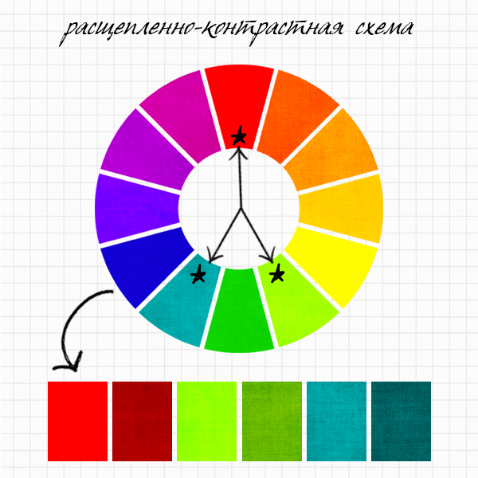

# Теория цвета. Гармоничные сочетания цветов. 

## Оглавление

- [Цвет](#цвет)
- [Теория цвета](#теория_цвета)
    - [Цветовой круг](#цветовой_круг)
        - [Комплиментарные цвета](#комплиментарные_цвета)
        - [Равноудаленные цвета](#равноудаленные_цвета)
        - [Родственные цвета](#родственные_цвета)
    - [Сочетание цветов](#сочетание_цветов)
        - [Первичные цвета](#первичные_цвета)
        - [Вторичные цвета](#вторичные_цвета)
        - [Третичные цвета](#третичные_цвета)
        - [Монохромное cочетание цветов](#монохромное_сочетание_цветов)
    - [Хроматические цвета](#хроматические_цвета)
    - [Ахроматические цвета](#ахроматические_цвета)
    - [Цветовые группы](#цветовые_группы)
- [Схема](#схема)
    - [Аналоговая цветовая схема](#аналоговая_схема)
    - [Контрастная цветовая схема](#контрастная_схема)
    - [Расщепленно-аналоговая цветовая схема](#расщепленно_аналоговая_схема)
    - [Расщепленно-контрастная цветовая схема](#расщепленно_контрастная_схема)
    - [Триада](#триада)
    - [Квадратическая цветовая схема](#квадратическая_схема)
    - [Прямоугольная цветовая схема](#прямоугольная_схема)

## Первичные цвета

Есть определенные методы, которые позволяют выбирать цвета так, чтобы они гармонично сочетались друг с другом. Для работы понадобится цветовой круг.

## Комплиментарные (дополняющие) цвета

Цвета, находящиеся на цветовом круге прямо напротив друг друга .Дополняющие цвета усиливают друг друга. Красный никогда не выглядит более красным, чем рядом с зеленым, и наоборот. Кроме того, в такой паре теплый цвет сочетается с холодным, что является естественным противоречием и интригующим фактором для нашего сознания. Наш разум бессознательно стремится к гармонии во всем, в том числе и в цветовых сочетаниях, поэтому, когда мы видим естественную напряженность между комплиментарными цветами, наш разум заставляет нас остановиться и посмотреть.Используйте дополняющие цвета тогда, когда вы хотите добиться максимального контраста, желаете привлечь внимание к образу в целом. Изменение степени осветленности и (или) насыщенности одного из цветов пары, сделает такое сочетание более гармоничным, так как два ярких цвета в образе сочетать достаточно трудно.

## Равноудаленные цвета

Равноудаленные по треугольнику на цветовом круге цвета. `Например: красный/желтый/синий или красно-фиолетовый/желто-оранжевый/сине-зеленый`.

## Родственные цвета

Соседние цвета на цветовом круге. 

## Первичные цвета

Составляют равносторонний треугольник на цветовом кругу – **красный, желтый , синий**. 

## Вторичные цвета

Чтобы понять, какие цвета являются вторичными, надо смешать попарно первичные в равных пропорциях. При этом получаются цвета второго порядка. Они располагаются между главными. Оранжевый, зеленый и фиолетовый – это вторичные цвета. В цветовом круге они так же образуют равносторонний треугольник.

## Третичные цвета

Они образуются при смешивании трех первичных с вторичными в равных пропорциях. Первичные, вторичные и третичные цвета вместе образуют 12-цветный круг. 

    

##  Монохромное (одноцветное) сочетание цветов. 

Выполняется оно на основе цвета и его оттенков в пределах одного сектора цветового круга.
Используется только один цвет в различных своих вариациях (оттенках). Например, оттенки синего: 
светло-синий, темно-синий, грязно-синий, выбеленный синий и т.д. Монохромные сочетания цветов работают, потому что 
они просты и понятны. В этой схеме присутствует чувство единства, потому что все оттенки являются производными от одного цвета. В таком сочетании визуальный интерес может быть направлен к конкретному элементу за счет выбора более яркого и насыщенного оттенка. Взгляните на шесть образцов выше. Ваши глаза, блуждая по оттенкам синего цвета, неизменно возвращаются к образцу №2, так как он здесь самый яркий. Это прекрасный пример того, как выделить какой-то объект в однотонной цветовой гамме.Используйте
монохромную схему, когда вам хочется достигнуть чувства единства, сплоченности. Когда вам нужно объединить множество конкурирующих друг с другом деталей. Кроме того, эта схема полезна тем, кто только учится работать с цветом, так как она наиболее проста и понятна.

    

## Xроматические цвета

Цвета делятся на две категории — хроматические и ахроматические. К хроматическим цветам относятся красный, желтый, оранжевый, зеленый, синий, фиолетовый цвета и все их смеси. Хроматические цвета мы видим индивидуально. 

## Ахроматические цвета

К ахроматическим (не имеющим цвета) относятся белый, черный и все оттенки серого, они различаются только по светлоте. 

## Цветовые группы цветов

Выделяют четыре цветовые группы: 
 * **спектральные светлые**  — цвета спектра, смешанные с белым цветом.
 * **темные — цвета спектра** — смешанные с черным.
 * **сероватые — цвета спектра** — смешанные с разными оттенками серого.

**[⬆ к оглавлению](#Оглавление)**

## Аналоговая цветовая схема.

В аналоговой цветовой схеме используются несколько цветов, находящихся рядом на цветовом круге. Например: `оранжевый/желто-оранжевый/желтый или желто-зеленый/зеленый/бирюзовый`. Вы можете выбрать два, три или четыре 
цвета.Аналогичные цвета переходят друг в друга постепенно и гармонично путем соединения близких вторичных и
третичных цветов. Для нашего восприятия это имеет смысл. Родственные цвета образуют сочетания, которые знакомы нам с детства как сочетания цветов радуги. Мы знаем, что за красным следует оранжевый, а за зеленым - голубой, синий и фиолетовый. Кроме того, родственные цвета имеют в своем составе какой-то общий цвет. Используйте аналоговую схему тогда, когда вы хотите создать комбинацию из более чем одного цвета, но все еще стремитесь к чувству единства, гармонии. Используйте один наиболее яркий оттенок цвета, чтобы привлечь внимание к определенной части вашего образа.

    

**[⬆ к оглавлению](#Оглавление)**

## Контрастная цветовая схема. 

Ее образуют **комплиментарные** (дополняющие) цвета, т.е. цвета, находящиеся на цветовом круге прямо 
напротив друг друга .Схемы получаются очень смелые и яркие. 
Примеры таких схем: `красный и зеленый`, `оранжевый и синий`, `желтый и фиолетовый` и т.д.
Дополняющие цвета усиливают друг друга, проявляются во всей своей красе. Красный никогда не выглядит более 
красным, чем рядом с зеленым, и наоборот. Кроме того, в такой паре теплый цвет сочетается с холодным, что является естественным 
противоречием и интригующим фактором для нашего сознания. Наш разум бессознательно стремится к гармонии во всем, в том числе и в цветовых сочетаниях, поэтому, когда мы видим естественную напряженность между комплиментарными цветами, наш разум заставляет нас остановиться и посмотреть.Используйте дополняющие цвета тогда, когда вы хотите добиться максимального контраста, желаете привлечь внимание к образу в целом. Изменение степени осветленности и (или) насыщенности одного из цветов пары, сделает такое сочетание более гармоничным, так как два ярких цвета в образе сочетать достаточно трудно.

    

    
**[⬆ к оглавлению](#Оглавление)**

## Расщепленно-аналоговая цветовая схема. 

В этой схеме используются несколько цветов, но цвета выбираются через один. Такая схема становится более динамичной и 
интересной.Являеться вариацией аналоговой схемы.

    

**[⬆ к оглавлению](#Оглавление)**

## Расщепленно-контрастная схема

В этой схеме мы выбирается не тот цвет, который расположен прямо напротив выбранного нами, а цвета, которые находятся рядом с ним по обе стороны. Таким образом вместо `красный/зеленый` мы выбираем схему:` красный/желто-зеленый/сине-зеленый`.Эта  схема являеться вариацией контрастной схемы.Цвета здесь не являются полной противоположностью, но близки к ней. Это создает достаточную напряженность, чтобы привлечь внимание нашего разума.Рекомендации по использованию данной схемы такие же, как и по использованию предыдущей. Можно применять расщепленно-контрастные цвета.

    

    
**[⬆ к оглавлению](#Оглавление)**

## Цветовая схема триада

В этой схеме используются три **равноудаленных** на цветовом круге цвета. `Например: красный/желтый/синий или красно-фиолетовый/желто-оранжевый/сине-зеленый`.Психологически триада воспринимается как динамичная, но устойчивая схема, так как в ее основе цвета, которые находятся на равном друг от друга расстоянии. Мозг воспринимает подобную схему как сбалансированную.Вы можете использовать равноудаленные цвета, чтобы создать более сложную, интригующую цветовую гамму.
 

    

 
## Квадратическая цветовая схема 

Использует четыре равноудаленных на цветовом круге цвета.Схема похожа на триаду,но добавляеться еще один четвертый цвет. Подобное сочетание хорошо работает при одном усиленном цвете и трех приглушенных. 

    

**[⬆ к оглавлению](#Оглавление)**

## Прямоугольная цветовая схема 

Вариация квадратической цветовой схемы. Разница в том, что в цветовой круг вписывается не квадрат, а в прямоугольник. 

    

**[⬆ к оглавлению](#Оглавление)**

